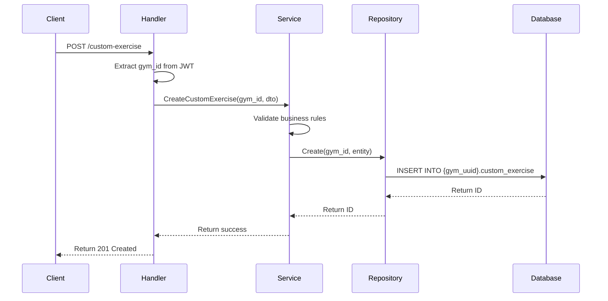
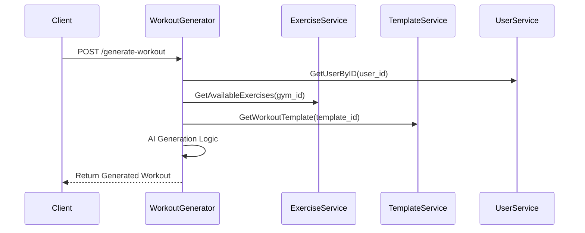

# Backend Architecture

## Overview

AthenAI follows a modular, multi-tenant architecture designed for scalability, maintainability, and security. The backend is built in Go using a standard module pattern that ensures consistency across all features.

## 🏗️ Module Organization

### **Platform Modules** (Public Schema)

These modules manage platform-wide resources and administration:

| Module                      | Purpose                          | Key Features                                   |
| --------------------------- | -------------------------------- | ---------------------------------------------- |
| **auth**                    | Authentication & JWT management  | Single login endpoint, platform/tenant routing |
| **gym**                     | Gym tenant management            | Registration, activation, domain management    |
| **exercise**                | Global exercise library          | Public exercise catalog, search, filtering     |
| **equipment**               | Global equipment catalog         | Equipment types, categories, specifications    |
| **muscular_group**          | Muscle group definitions         | Body parts, muscle classifications             |
| **template_block**          | Workout template components      | Reusable workout building blocks               |
| **workout_template**        | Global workout templates         | Shareable workout structures                   |
| **exercise_equipment**      | Exercise-equipment relationships | Links exercises to required equipment          |
| **exercise_muscular_group** | Exercise-muscle relationships    | Maps exercises to target muscles               |
| **workout_generator**       | AI workout generation            | Intelligent workout creation engine            |

### **Tenant Modules** (Gym-Specific Schemas)

These modules operate within individual gym schemas:

| Module                             | Purpose                         | Key Features                                |
| ---------------------------------- | ------------------------------- | ------------------------------------------- |
| **user**                           | Gym member management           | User profiles, roles, preferences           |
| **custom_equipment**               | Gym-specific equipment          | Equipment not in global catalog             |
| **custom_exercise**                | Gym-specific exercises          | Custom exercises created by gym             |
| **custom_exercise_equipment**      | Custom exercise-equipment links | Relationships for custom exercises          |
| **custom_exercise_muscular_group** | Custom exercise-muscle links    | Muscle targeting for custom exercises       |
| **custom_template_block**          | Gym workout template blocks     | Custom reusable components                  |
| **custom_workout_template**        | Gym workout templates           | Gym-specific workout structures             |
| **custom_member_workout**          | Member workout assignments      | Workout plans assigned to members           |
| **custom_workout_instance**        | Active workout sessions         | Filled workout templates for execution      |
| **custom_workout_exercise**        | Individual workout exercises    | Specific exercises within workout instances |

### **Infrastructure Modules**

Supporting modules for core functionality:

| Module       | Purpose                          | Key Features                             |
| ------------ | -------------------------------- | ---------------------------------------- |
| **database** | Database connections & utilities | PostgreSQL connection, schema management |

## 🔄 Standard Module Pattern

Every module follows this consistent structure:

```go
internal/{module_name}/
├── dto/                    # Data Transfer Objects
│   ├── create_{entity}.dto.go
│   ├── update_{entity}.dto.go
│   └── response_{entity}.dto.go
├── enum/                   # Enumerations
│   └── {field_name}.enum.go
├── handler/                # HTTP layer
│   └── {module}_handler.go
├── interfaces/             # Contracts
│   ├── {module}_handler.interface.go
│   ├── {module}_repository.interface.go
│   └── {module}_service.interface.go
├── repository/             # Data layer
│   ├── {module}_repository.go
│   └── {module}_repository_test.go
├── router/                 # Route definitions
│   └── {module}_router.go
├── service/                # Business logic
│   └── {module}_service.go
└── module/                 # Dependency injection
    └── {module}_module.go
```

## 🌐 Multi-Tenant Architecture

### Schema Isolation Strategy

```
PostgreSQL Database
├── public schema                    # Platform-wide data
│   ├── gym                         # Tenant registry
│   ├── admin                       # Platform administrators
│   ├── exercise                    # Global exercise library
│   ├── equipment                   # Global equipment catalog
│   ├── muscular_group              # Muscle definitions
│   ├── template_block              # Shared template components
│   ├── workout_template            # Public workout templates
│   ├── exercise_equipment          # Exercise-equipment links
│   └── exercise_muscular_group     # Exercise-muscle links
│
└── {gym_uuid} schemas              # Tenant-specific data
    ├── users                       # Gym members and staff
    ├── custom_equipment            # Gym-specific equipment
    ├── custom_exercise             # Gym-created exercises
    ├── custom_exercise_equipment   # Custom exercise equipment links
    ├── custom_exercise_muscular_group # Custom exercise muscle links
    ├── custom_template_block       # Gym template components
    ├── custom_workout_template     # Gym workout templates
    ├── custom_member_workout       # Member workout assignments
    ├── custom_workout_instance     # Active workout sessions
    └── custom_workout_exercise     # Individual workout exercises
```

### Tenant Isolation Benefits

- **Data Security**: Each gym's data is completely isolated
- **Scalability**: Easy to add new tenants without affecting existing ones
- **Performance**: Queries only search within relevant schema
- **Backup/Restore**: Individual tenant data management
- **Compliance**: Meet data residency and privacy requirements

## 🔐 Security Architecture

### Authentication Flow

```mermaid
graph TD
    A[Client Request] --> B{X-Gym-ID Header?}
    B -->|No| C[Platform Admin Auth]
    B -->|Yes| D[Tenant User Auth]
    C --> E[public.admin lookup]
    D --> F[gym lookup by ID]
    F --> G[{gym_uuid}.users lookup]
    E --> H[Generate JWT with admin claims]
    G --> I[Generate JWT with tenant claims]
    H --> J[Return JWT]
    I --> J
```

### JWT Claims Structure

```json
{
  "user_id": "uuid",
  "user_type": "platform_admin|tenant_user",
  "username": "string",
  "role": "admin|user|guest", // Only for tenant users
  "gym_id": "uuid", // Only for tenant users
  "is_active": true,
  "exp": 1234567890,
  "iat": 1234567890
}
```

### Authorization Matrix

| User Type          | Access Level       | Restrictions                                 |
| ------------------ | ------------------ | -------------------------------------------- |
| **Platform Admin** | Full system access | Can manage all gyms and platform resources   |
| **Gym Admin**      | Gym-wide access    | Limited to own gym's data and users          |
| **Gym User**       | Member access      | Limited to own profile and assigned workouts |

## 🔌 API Integration Points

### Module Wiring in API

```go
// api/api.go
func NewAPI(db *sql.DB) http.Handler {
    r := chi.NewRouter()

    // Platform routes (no gym context required)
    platformRoutes := middleware.PlatformRoutes()
    platformRoutes.Mount("/auth", authmodule.NewAuthModule(db))
    platformRoutes.Mount("/gym", gymmodule.NewGymModule(db))
    platformRoutes.Mount("/exercise", exercisemodule.NewExerciseModule(db))
    // ... other platform modules

    // Tenant routes (require gym context)
    tenantRoutes := middleware.TenantRoutes()
    tenantRoutes.Mount("/user", usermodule.NewUserModule(db))
    tenantRoutes.Mount("/custom-exercise", customexercisemodule.NewCustomExerciseModule(db))
    // ... other tenant modules

    r.Mount("/api/v1", platformRoutes)
    r.Mount("/api/v1", tenantRoutes)

    return r
}
```

### Cross-Module Dependencies

Some modules depend on others for complete functionality:

```go
// Example: Workout Generator depends on multiple services
func NewWorkoutGeneratorModule(
    exerciseSvc exerciseIF.ExerciseService,
    workoutTemplateSvc workoutTemplateIF.WorkoutTemplateService,
    templateBlockSvc templateIF.TemplateBlockService,
    userSvc userIF.UserService,
) http.Handler {
    // Module wiring with injected dependencies
}
```

## 📊 Data Flow Examples

### Creating a Custom Exercise



### Generating AI Workout



## 🚀 Performance Considerations

### Database Optimization

- **Schema-specific indexes** for tenant data
- **Connection pooling** for database efficiency
- **Query optimization** using prepared statements
- **Pagination** for large datasets

### Caching Strategy

- **JWT validation** caching to reduce database hits
- **Template caching** for frequently used workout templates
- **Exercise library** caching for search operations

### Scalability Features

- **Horizontal scaling** through stateless design
- **Load balancing** capability with JWT-based auth
- **Database sharding** by tenant schema
- **Microservice** potential with module boundaries

---

This architecture ensures AthenAI can scale from small gyms to large fitness chains while maintaining security, performance, and maintainability.
